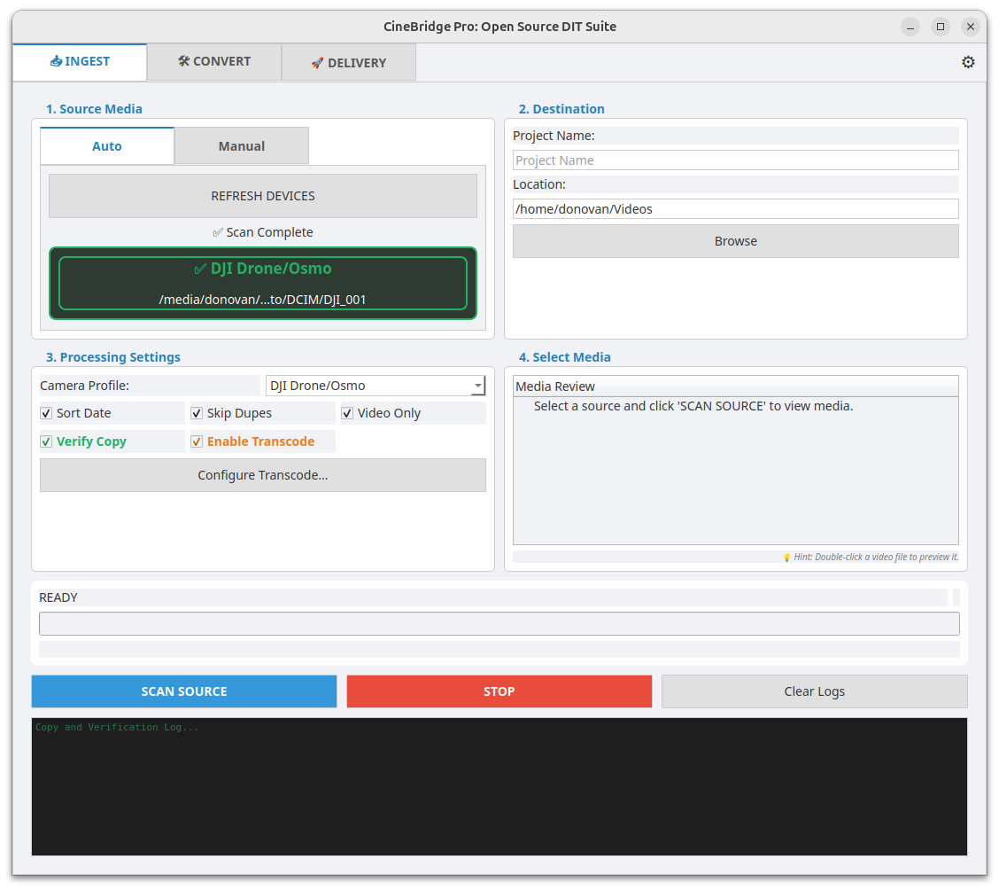

# CineBridge Pro: The Professional Linux DIT Suite

**CineBridge Pro** is an open-source Digital Imaging Technician (DIT) and Post-Production suite specifically engineered to solve the **"Resolve on Linux" problem**.

### 🐧 The Linux Gap
While DaVinci Resolve is a world-class NLE on Linux, the **Free Version** lacks native support for standard H.264/H.265 (HEVC) codecs due to licensing restrictions. This often leaves Linux users with "Media Offline" errors or the need for complex command-line transcoding.

**CineBridge Pro bridges this gap** by providing a high-performance, GUI-driven workflow to:
1. **Offload** media securely from professional cameras.
2. **Verify** data integrity with industry-standard checksums (xxHash64/MD5).
3. **Automate** organization into dated, camera-specific hierarchies.
4. **Transcode** consumer/phone footage into edit-ready, high-fidelity formats like **DNxHR** and **ProRes** that work natively in Resolve on Linux.

---

## 🚀 Key Features

### 📥 Professional Ingest
* **Device Registry:** Intelligent, high-reliability auto-detection for Sony (Alpha/FX), Blackmagic (BRAW), Canon (CRM), DJI, GoPro, Insta360, and Android devices.
* **Scan & Select:** A powerful preview phase allowing you to scan your media and select exactly which shoot days or specific clips to transfer.
* **Smart Filtering:** Automatically excludes system files and only targets media extensions relevant to your specific camera profile.
* **Standardized Organization:** Automatically sorts files by Date -> Camera -> Category (Video/Photo/Audio/Misc).

### 🛠️ Transcoding & Dailies
* **Edit-Ready Workflows:** Single-click conversion to Linux-friendly codecs (**DNxHR HQ/LB** and **ProRes 422/Proxy**).
* **Visual Overlays (Burn-in):** Professional "Dailies" tools to burn Filenames, Timecodes, and custom Watermarks into your proxies.
* **3D LUT Support:** Apply `.cube` LUTs during transcoding to see your creative intent immediately.
* **Audio Drift Correction:** Specialized logic to sync variable-frame-rate audio (common in phone footage) and normalize to 48kHz.
* **Hardware Acceleration:** Native support for NVIDIA (NVENC), Intel (QSV), VAAPI, and MacOS VideoToolbox.

### 🛡️ Data Integrity & Reporting
* **MHL Support:** Generates ASC-MHL compliant XML checksum lists to ensure bit-for-bit accuracy throughout the pipeline.
* **DIT Transfer Reports:** Automatically generates professional PDF reports with project metadata and transfer summaries.
* **Checksum Verification:** Built-in verification using **xxHash64** (fastest) or MD5.
* **Pre-Flight Check:** Prevents transfers if the destination drive lacks sufficient space.

---

## 📦 Installation

### 📥 Releases (Pre-Compiled)
For most users, we recommend downloading the standalone installer for your OS.

* **[Download Latest Release Here](https://github.com/DGxInfinitY/CineBridge-Pro/releases/latest)**

### 🛠️ Manual Build (For Developers)
1.  **Clone the Repository:** `git clone https://github.com/DGxInfinitY/CineBridge-Pro.git`
2.  **Install Dependencies:** `pip install PyQt6 psutil xxhash`
3.  **Run:** `python3 src/cinebridge.py`

### 📋 Prerequisites
* **Python 3.10+**
* **FFmpeg** (Included in Windows/Mac releases; Linux users should install via `apt install ffmpeg`)

---

## 📝 Change Log

### v4.16.3 (Current Release)
* **Architecture:** Complete modular refactor of the codebase (`src/modules/`) for improved maintainability and stability.
* **New Feature:** **Smart Transcode.** Automatically skips re-encoding for source files that are already edit-friendly (DNxHR/ProRes).
* **Stability:** **Watch Folder Safety.** Implemented a "File Stability Check" to prevent transcoding files that are still being copied.
* **Improvement:** **Device Detection.** Fixed false positives where generic USB drives were identified as Blackmagic or Insta360 cameras.
* **UI/UX:** Enhanced dark mode support for Job Reports and improved responsiveness during large media scans.
* **Dev:** Added automated unit test suite.

### v4.16.1
* **UI/UX:** Added "Experimental / Pro Features" section in Settings to toggle the visibility of **Watch Folder** and **Burn-in Tools**.
* **Improvement:** Optimized system resources by consolidating background monitors into a single global instance.
* **Stability:** Hardened application shutdown logic to prevent hangs during heavy background processing.

### v4.16.0
* **New Feature:** **Watch Folder Service.** Background proxy generation for any files dropped into a watched directory.
* **New Feature:** **Professional Burn-In.** Added Timecode, Filename, and Watermark overlays for Dailies.
* **New Feature:** **DIT PDF Reports.** Beautiful project hand-off documents generated automatically.
* **New Feature:** **MHL Support.** Industry-standard XML checksum lists for media integrity.

### v4.15.x
* **Refactor:** Standardized data storage using **XDG XDG Base Directory** specs (`~/.local/share/cinebridge-pro`).
* **New Feature:** **Transcode Preset Management.** Full suite to Save, Import, and Export custom profiles.
* **Distribution:** Added a professional Windows Setup Installer and automated metadata synchronization.

### v4.14.0
* **New Feature:** **Ingest Overhaul.** High-performance "Scan Source" phase with Tree View selection.
* **New Feature:** **Metadata Viewer.** Right-click queue items to inspect codec, resolution, and bitrate.
* **New Feature:** **Visual Thumbnails.** Added high-quality frame extraction for the job queue.
* **Design:** Completely updated UI with a responsive Dashboard layout and new modern "Bridge" icon.

---

## ⚙️ Configuration & Debugging
* **FFmpeg Settings:** Manually select custom FFmpeg binaries to unlock specialized hardware features.
* **Troubleshooting:** Detailed, structured logs are saved to `~/cinebridge_pro.log` (accessible via the Settings menu).

---

Developed by **Donovan Goodwin** with help from Gemini AI.
